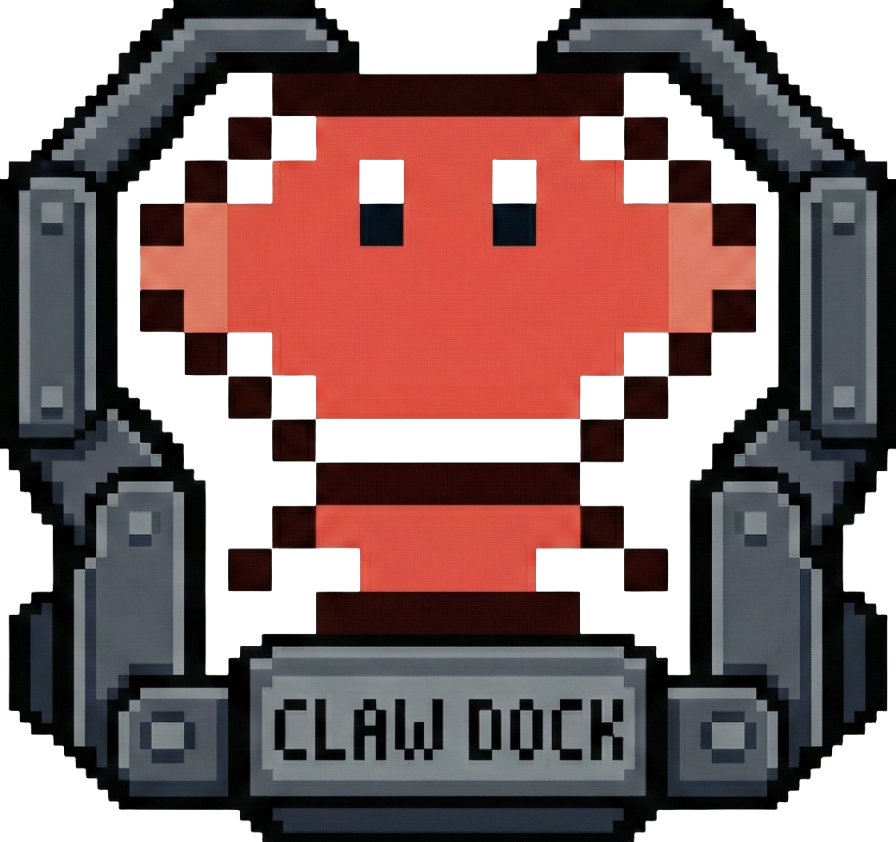

<p align="center">
  
</p>

<h1 align="center">ClawDock</h1>

<p align="center">
  One-click Windows installer & launcher for <a href="https://github.com/openclaw/openclaw">OpenClaw</a>
</p>

<p align="center">
  English | <a href="README_CN.md">中文</a>
</p>

---

[OpenClaw](https://github.com/openclaw/openclaw) is a self-hosted personal AI assistant platform that integrates with WhatsApp, Telegram, Slack, Discord, and other messaging services. There is currently no official Windows-native installation — **ClawDock** fills that gap by automating the entire WSL2 + Ubuntu + Node.js + OpenClaw setup into a single desktop application.

## Features

- **One-Click Install** — Automatically provisions WSL2, imports an embedded Ubuntu 22.04 rootfs, installs Node.js 22 and OpenClaw. No terminal required.
- **Built-in Browser** — Access the OpenClaw Web UI directly inside the app via WebView2 (Edge engine).
- **Gateway Management** — Start / Stop / Restart the OpenClaw Gateway with one click. Real-time log console included.
- **System Tray** — Minimize to tray and keep running in the background. Double-click the icon to restore.
- **Clean Uninstall** — Remove OpenClaw and optionally the entire WSL2 distro with a single action.

## Requirements

| Requirement | Details |
|---|---|
| **OS** | Windows 10 Build 19041+ or Windows 11 |
| **WebView2** | Microsoft Edge (ships with modern Windows) |
| **CPU** | Hardware virtualization support (VT-x / AMD-V, enabled by default on most machines) |

## Installation Flow

The built-in setup wizard handles everything automatically:

1. **System Check** — Verifies Windows version, WSL2 status, and virtualization support.
2. **WSL2 Setup** — Enables WSL2 features and imports an embedded Ubuntu 22.04 image (offline, no download needed).
3. **OpenClaw Install** — Installs Node.js 22 + OpenClaw inside WSL2 (uses China mirror for faster downloads).
4. **Done** — Launches the main interface with the Gateway ready to start.

> A reboot may be required after Step 2 if WSL2 was not previously enabled. The app will resume installation automatically after restart.

## Build from Source

### Prerequisites

- [.NET 8 SDK](https://dotnet.microsoft.com/download/dotnet/8.0)

### Build

```powershell
# Clone
git clone https://github.com/LiuHao-1443/ClawDock.git
cd ClawDock

# Build (auto-downloads Ubuntu rootfs + compiles)
.\build.ps1 -SkipInno
```

> `ubuntu-base.tar.gz` is not tracked in git. The build script downloads it automatically from a [USTC mirror](https://mirrors.ustc.edu.cn).

### Output

```
src/ClawDock/bin/publish/ClawDock.exe   # Self-contained single-file executable (~184 MB, no .NET runtime needed)
```

## Project Structure

```
ClawDock/
├── src/ClawDock/
│   ├── Views/                  # WPF windows (Install wizard, Main, Uninstall)
│   ├── Services/               # Core services
│   │   ├── WslService.cs       #   WSL2 detection, installation & management
│   │   ├── OpenClawService.cs  #   Node.js + OpenClaw installation
│   │   ├── GatewayService.cs   #   Gateway process lifecycle & health checks
│   │   ├── InstallStateService.cs  #   Persisted install state (registry)
│   │   └── UninstallService.cs #   Clean removal of all components
│   └── Assets/                 # Icon, logo, embedded Ubuntu rootfs
├── assets/                     # README resources (banner)
└── build.ps1                   # One-command build script
```

## Tech Stack

| Layer | Technology |
|---|---|
| **UI** | C# 12 / .NET 8 / WPF |
| **Embedded Browser** | Microsoft.Web.WebView2 (Edge engine) |
| **Runtime Environment** | WSL2 + Ubuntu 22.04 |
| **OpenClaw Runtime** | Node.js 22 |

## License

[MIT](LICENSE)

---

> This is a community project and is not affiliated with the official OpenClaw team.
